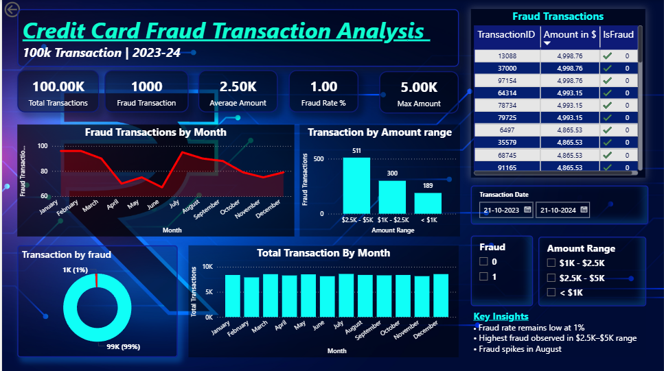

# 📊 Dynamic Sales Analytics Dashboard – Data Analytics Report

## 📌 Project Overview
The **Dynamic Sales Analytics Dashboard** is designed to analyze sales performance using interactive visualizations. The dashboard provides insights into sales profit, product performance, payment methods, state-wise sales distribution, and category-level demand.

The goal of this dashboard is to help businesses **monitor sales trends, identify profitable products, and optimize decision-making through data-driven insights.**

---

# 🎯 Objectives

The main objectives of this project are:

- Analyze **monthly sales profit trends**
- Identify **high-performing product sub-categories**
- Understand **state-wise sales distribution**
- Evaluate **customer payment preferences**
- Study **category-wise quantity demand**

---

# 🛠 Tools & Technologies

- **Power BI** – Data visualization and dashboard development  
- **Power Query** – Data cleaning and transformation  
- **DAX (Data Analysis Expressions)** – Data modeling and calculations  
- **Dataset** – Retail Sales Dataset  

---

# 📊 Key Performance Indicators (KPIs)

| Metric | Value |
|------|------|
| Total Profit | **37K** |
| Total Quantity Sold | **5615** |
| Total Sales Amount | **438K** |
| Average Sales Value | **120.90K** |

These KPIs provide a quick overview of the overall sales performance.

---

# 📈 Dashboard Analysis & Insights

## 1️⃣ Monthly Profit Analysis

The **Sum of Profit by Month** chart shows the monthly profit performance.

### Key Observations

- Highest profit months include **January, February, March, and November**
- Some months like **May and July** show negative profit
- Profit increases again towards the **end of the year**

**Insight:**  
Sales performance fluctuates throughout the year, suggesting **seasonal demand patterns** and potential inventory or marketing impacts.

---

## 2️⃣ Profit by Sub-Category

This visualization highlights which product sub-categories generate the highest profit.

### Top Profitable Sub-Categories

1. **Printers**
2. **Bookcases**
3. **Saree**
4. **Accessories**
5. **Tables**

**Insight:**  
Printers and Bookcases generate the highest profits, indicating strong demand or higher margins in these sub-categories.

---

## 3️⃣ State-wise Sales Distribution

The **Sum of Amount by State** chart shows sales distribution across different states.

### Top States by Sales

1. **Maharashtra**
2. **Madhya Pradesh**
3. **Uttar Pradesh**
4. **Delhi**
5. **Rajasthan**

**Insight:**  
Maharashtra and Madhya Pradesh contribute the highest share of total sales.

---

## 4️⃣ Payment Mode Analysis

This chart shows the distribution of payment methods used by customers.

| Payment Mode | Sales |
|--------------|------|
| Cash on Delivery (COD) | **155K (35.45%)** |
| Credit Card | **87K (19.86%)** |
| EMI | **78K (17.79%)** |
| UPI | **69K (15.68%)** |
| Others | Smaller share |

**Insight:**  
**Cash on Delivery is the most preferred payment method**, suggesting that customers still rely heavily on traditional payment options.

---

## 5️⃣ Quantity Sold by Category

This visualization shows product demand across different categories.

| Category | Quantity |
|----------|----------|
| Clothing | **4K (≈62%)** |
| Electronics | **1K (≈20%)** |
| Furniture | **1K (≈16%)** |

**Insight:**  
Clothing products dominate sales volume, accounting for the majority of total items sold.

---

# 🎛 Dashboard Filters

The dashboard includes interactive filters to allow deeper analysis:

- **Sub-Category Filter**
- **Category Filter**

These filters allow users to dynamically explore sales performance for specific product groups.

---

# 📊 Key Findings

- Total sales revenue reached **438K**, generating **37K profit**.
- **Clothing category dominates product demand**.
- **Printers and Bookcases are the most profitable sub-categories**.
- **Maharashtra contributes the highest sales amount**.
- **Cash on Delivery is the most commonly used payment method**.
- Sales profits vary significantly across months, showing potential **seasonal trends**.

---

# 🚀 Conclusion

The **Dynamic Sales Analytics Dashboard** provides a comprehensive overview of sales performance across different product categories, regions, and payment methods.

Using data analytics, businesses can:

- Identify profitable product segments
- Understand customer purchasing behavior
- Monitor monthly sales performance
- Optimize sales strategies

This dashboard demonstrates how **business intelligence tools like Power BI can transform raw sales data into actionable insights.**

---

## 📷 Dashboard Preview

